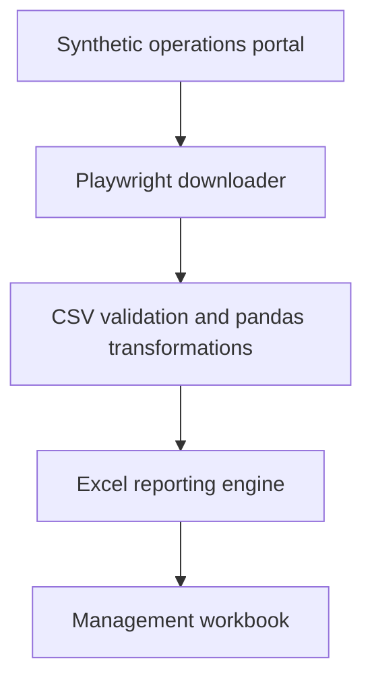

# Operational Reporting Automation

[](https://github.com/brenocorcino/operational-reporting-automation/actions/workflows/tests.yml)

A fully synthetic portfolio project that automates operational report extraction, validation, consolidation, and Excel delivery using **Playwright, Python, pandas, and openpyxl**.

The repository includes a safe local portal that behaves like an export center. The automation selects a report date, downloads three CSV reports through a real browser session, validates their schemas, calculates operational indicators, and creates a formatted management workbook.

No employer source code, credentials, private URLs, or real operational data are included.

## Business problem

Recurring operational reporting often requires the same manual sequence: access a portal, select a date, export several files, validate columns, consolidate results, calculate indicators, format an Excel workbook, and distribute it.

This project turns that sequence into a reproducible pipeline:

- Browser-based extraction with Playwright
- Explicit download handling and deterministic filenames
- Schema validation before processing
- KPI calculations with pandas
- Excel workbook generation with styling and a chart
- Separate detail sheets for collections, transfers, and exceptions
- Unit tests and continuous integration with GitHub Actions

## Architecture



## Generated workbook

| Sheet | Purpose |
| --- | --- |
| Summary | Report date, package KPIs, collection rate, transfer rate, exceptions, and chart |
| Collection | Hub-level planned, collected, on-time, and collection-rate details |
| Transfers | Route-level shipments, punctuality, delays, and on-time rate |
| Exceptions | Operational exception type and affected-shipment details |
| Summary Data | Hidden structured source used to preserve consolidated values |

## Project structure

```text
operational-reporting-automation/
├── .github/workflows/tests.yml
├── data/source/
│   ├── collection_performance.csv
│   ├── scan_exceptions.csv
│   └── transfer_performance.csv
├── src/report_automation/
│   ├── config.py
│   ├── downloader.py
│   ├── mock_portal.py
│   ├── pipeline.py
│   ├── transform.py
│   └── workbook.py
├── tests/
├── .env.example
├── LICENSE
├── requirements.txt
└── SECURITY.md
```

## Quick start on Windows PowerShell

Requirements: Python 3.12 and Git.

```powershell
git clone https://github.com/brenocorcino/operational-reporting-automation.git
cd operational-reporting-automation
py -m venv .venv
.venv\Scripts\Activate.ps1
pip install -r requirements.txt
playwright install chromium
Copy-Item .env.example .env
```

Start the synthetic portal in the first PowerShell window:

```powershell
$env:PYTHONPATH = "src"
uvicorn report_automation.mock_portal:app --app-dir src --port 8010
```

Run the automation in a second PowerShell window:

```powershell
.venv\Scripts\Activate.ps1
$env:PYTHONPATH = "src"
py -m report_automation.pipeline --date 2026-08-25
```

The generated workbook will be available at:

```text
outputs/operational_report_2026-08-25.xlsx
```

Interactive portal documentation: <http://127.0.0.1:8010/docs>

## Run the tests

```powershell
$env:PYTHONPATH = "src"
py -m unittest discover -s tests -v
```

The same suite runs automatically in GitHub Actions on pushes, pull requests, and manual executions.

## Engineering decisions

### Safe and reproducible browser automation

The included portal is local and uses only synthetic CSV files. Playwright still performs a real browser session and handles downloads through `expect_download`, which demonstrates the automation pattern without relying on a private system.

### Validation before reporting

Every source file is checked for its required schema before KPI calculation. Missing columns produce a clear exception instead of silently creating an incomplete workbook.

### Weighted indicators

Consolidated rates are calculated from total volumes, not by averaging row percentages. This avoids distorted indicators when hubs or routes have different volumes.

### Outputs outside version control

Downloads, generated workbooks, environment files, and browser artifacts are ignored by Git. The repository preserves reproducible code and synthetic inputs without publishing execution residue.

## Technology stack

- Python 3.12
- Playwright
- pandas
- openpyxl
- FastAPI and Uvicorn for the synthetic portal
- GitHub Actions
- Python `unittest`

## License

MIT — see [LICENSE](LICENSE).

## Privacy and scope

All report dates, hubs, routes, volumes, and exceptions are fictional. Review [SECURITY.md](SECURITY.md) before adapting the project.

---

<details>
<summary><strong>Versão em português</strong></summary>

## Visão geral

Projeto público de portfólio que automatiza a extração, validação, consolidação e entrega de relatórios operacionais em Excel usando **Playwright, Python, pandas e openpyxl**.

O repositório contém um portal local e seguro que simula uma central de exportações. A automação seleciona a data, baixa três relatórios CSV por uma sessão real de navegador, valida as colunas, calcula indicadores e gera uma planilha gerencial formatada.

Não há código de empregadores, credenciais, endereços privados ou dados operacionais reais.

## Fluxo automatizado

- Extração pelo navegador com Playwright
- Controle explícito dos downloads e nomes determinísticos
- Validação do esquema antes do processamento
- Cálculo de indicadores com pandas
- Geração do Excel com estilos e gráfico
- Abas separadas para coleta, transferência e exceções
- Testes automatizados e integração contínua no GitHub Actions

## Execução no PowerShell

```powershell
git clone https://github.com/brenocorcino/operational-reporting-automation.git
cd operational-reporting-automation
py -m venv .venv
.venv\Scripts\Activate.ps1
pip install -r requirements.txt
playwright install chromium
Copy-Item .env.example .env
$env:PYTHONPATH = "src"
```

No primeiro terminal, inicie o portal fictício:

```powershell
uvicorn report_automation.mock_portal:app --app-dir src --port 8010
```

No segundo terminal, execute a automação:

```powershell
py -m report_automation.pipeline --date 2026-08-25
```

O resultado será salvo em `outputs/operational_report_2026-08-25.xlsx`.

</details>

---

## Author

**Breno Corcino** — Data Analytics, Data Engineering & Software

[GitHub](https://github.com/brenocorcino) · [LinkedIn](https://www.linkedin.com/in/breno-corcino-7817731aa/)
